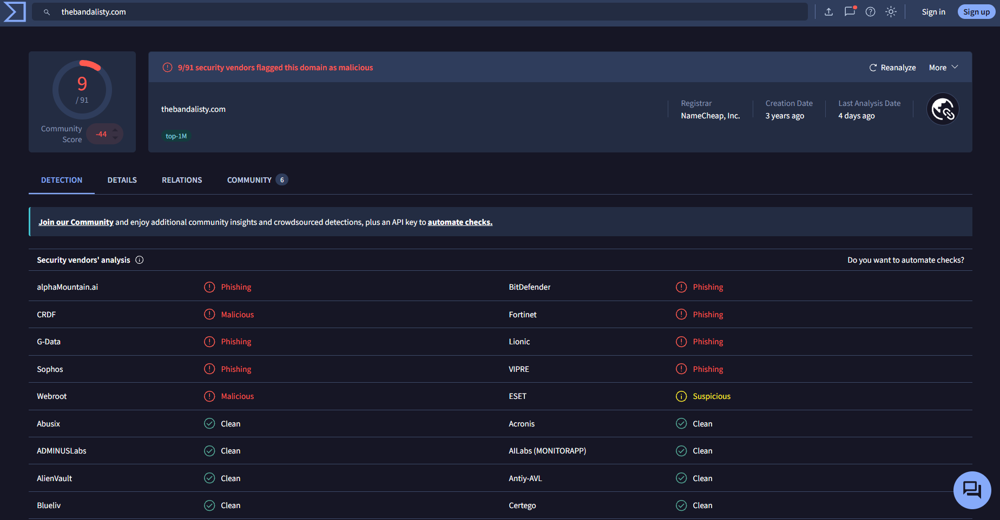

# Phishing Campaign Investigation

Abdellah Bayar | 5 October 2026

## Scope and findings

Two connected exercises with distinct messages, dates and evidence.

**Outcome:** the archived message is assessed as phishing using Microsoft brand impersonation and reply redirection. A separate, harmless simulation was delivered to five local mailboxes; two recipients were absent from To and Cc.

| Investigation part | Completed work | Boundary |
| --- | --- | --- |
| Archived sample, 2023 | Inspected headers, authentication results, HTML destinations and captured domain reports. | Original recipients and user interaction remain unknown. |
| Controlled simulation, 2026 | Submitted one labelled message, correlated its identifiers and verified five received copies. | Delivery measured. Opening, clicking and account compromise not measured. |

### Environment and tools

Windows Hyper-V hosts SOC-Mail-Lab: Ubuntu Server 24.04.5 LTS, 4 GB RAM, 2 vCPUs and a 40 GB virtual disk. Postfix 3.8.6 delivers to Maildir; Swaks 20240103.0 records the SMTP exchange. OpenSSH/SCP export the files. Notepad and existing VirusTotal reports support the archived analysis.

Postfix listens on loopback only and rejects non-local transport. All five recipient accounts use lab.test. The VM uses the Hyper-V Default Switch for installation connectivity; this is not an air-gapped VM.

### What the exercise demonstrates

Assess a suspicious message using observable evidence, then determine local delivery scope from server records. To and Cc are visible message fields; the SMTP envelope and delivery events provide additional recipient information. [6, 7]

## Sender and authentication

Archived sample-10.eml: external SMTP handoff on 8 September 2023 at 05:47:04 UTC.

The sample comes from the public Phishing Pot collection, not my own inbox. Recipient information is anonymised as phishing@pot. The file was inspected as text without opening its links or loading its external image. [1]

| Field | Recorded evidence | Interpretation |
| --- | --- | --- |
| Display name | Microsoft account team | Claims a Microsoft identity. |
| From | no-reply@access-accsecurity[.]com | Differs from the documented Microsoft account alert sender. [2] |
| Reply-To | sotrecognizd@gmail[.]com | Replies go to an unrelated mailbox. |
| SMTP sender domain | thcultarfdes[.]co.uk | Separate from the visible From domain. |
| SMTP peer IP | 89.144.44.2 | Recorded by the receiving gateway. |

### Results recorded by the archived gateway

| Check | Recorded result | Meaning in this sample |
| --- | --- | --- |
| SPF | none | No SPF policy was found for the SMTP sender domain. |
| DKIM | none | The message was not signed. |
| DMARC | permerror; action=none | Permanent evaluation error; the exact cause is unknown. |

These results are **not fail**. Authentication results provide context and do not alone prove phishing. DNS was not re-evaluated; the local simulation does not reproduce these archived gateway results. [3, 4]

## Destinations and reputation

Distinguish the message content from assumptions about a possible attack.

All three HTML action links are mailto links to the same Gmail Reply-To address, also in CC. They prepare email drafts. No web sign-in destination or password form was observed. A hidden 1 x 1 image from thebandalisty[.]com/track/... is consistent with possible email tracking; its presence does not establish that any recipient loaded it.

Russia/Moscow and 103.225.77.255 are unverified sign-in claims in the body. That IP is different from the SMTP peer IP. Neither proves a real login, identifies a person or establishes account compromise.

| Domain / role | Malicious detections | Last analysis displayed |
| --- | --- | --- |
| access-accsecurity[.]com / From | 0/91 | 2 months ago |
| thcultarfdes[.]co.uk / SMTP sender | 0/91 | 26 days ago |
| thebandalisty[.]com / image host | 9/91 | 4 days ago |

Captured VirusTotal report, recorded 5 October 2026: seven Phishing and two Malicious classifications; ESET Suspicious is shown separately. [5]



A 0/91 result does not establish safety. These 2026 reports do not establish the domains' reputation when the archived email was sent in 2023.

## Controlled campaign and tracing

A separate, labelled Microsoft impersonation simulation on 5 October 2026.

**OBSERVED HEADERS IN ALICE'S RECEIVED COPY**

```text
From: Microsoft account team
      <security@account-alerts.test>
Reply-To: helpdesk@account-review.test
To: alice@lab.test
Cc: bob@lab.test, edoardo@lab.test
Subject: [SOC-LAB SIMULATION] Unusual sign-in activity
X-Lab-Simulation: true
X-Lab-Campaign: microsoft-impersonation-01
```

The message claims Microsoft authority, adds a 24-hour account restriction pretext and requests review at http://account-review.test/verify. Its From and Reply-To use different test domains. These features model a phishing lure. The message is explicitly a harmless simulation; no website, tracking service or credential form was provided. The .test suffix is reserved for testing. [8]

### Identifier correlation

Alice's received copy contains the Message-ID below. The Postfix cleanup record maps it to queue ID **07C5A1E01FC**. Records for that queue show five recipients and successful local deliveries.

**MESSAGE IDENTIFIER AND OBSERVED LOG VALUES**

```text
<179120320293.1674.8861293320127582421.phishing-lab-20261005T122642Z-08257e25@lab.test>
Queue ID: 07C5A1E01FC
Queue record: nrcpt=5 (queue active)
Delivery result: dsn=2.0.0
status=sent (delivered to maildir)
```

The local simulation has no Authentication-Results header. SPF, DKIM and DMARC verdicts were not evaluated or injected. The archived authentication values belong to the separate 2023 message.

## Confirmed delivery scope

Native Postfix events and original received copies agree on all five recipients.

| Recipient | Visible in | Delivery time UTC | Maildir copy |
| --- | --- | --- | --- |
| alice@lab.test | To | 12:26:43.048235 | Confirmed |
| bob@lab.test | Cc | 12:26:43.050774 | Confirmed |
| carol@lab.test | Absent | 12:26:43.052262 | Confirmed |
| edoardo@lab.test | Cc | 12:26:43.054041 | Confirmed |
| vittorio@lab.test | Absent | 12:26:43.054089 | Confirmed |

All timestamps are 5 October 2026. At this date, 12:26:43 UTC corresponds to 14:26:43 in Italy (UTC+02). The queue contains nine exported log records and was removed after successful local processing.

### Why the visible headers miss two recipients

The SMTP transcript includes RCPT TO for all five accounts. The controlled message specifies only Alice in To and Bob and Edoardo in Cc. Carol and Vittorio therefore received blind-copy-equivalent delivery. No Bcc field was included. In production, header absence could also reflect forwarding or a distribution list; it alone does not prove Bcc delivery. [6, 7]

### What successful delivery establishes

The server recorded successful delivery to each local Maildir, and one matching native received file was exported from each account. A 250 SMTP acceptance response alone would not establish all five final mailbox outcomes; the per-recipient delivery records and copies supply that evidence.

**Interaction and impact:** openings, clicks, replies, credential entry and compromise were not measured. The five confirmed deliveries describe this local simulation only. The archived phishing campaign's real recipient scope remains unknown.

## Response and integrity

Recommended actions are separated from the actions actually completed.

1. **Preserve and report.** Keep the original message and trace evidence. Report through the organisation's phishing process; avoid replying or loading external content.

2. **Scope and contain.** Search mail-flow records for confirmed related copies. Review and quarantine matches; apply targeted blocks after validating the indicators. Do not block all Gmail traffic based on this sample.

3. **Investigate interaction.** Use available click, proxy and identity logs to test whether recipients interacted. If credentials were disclosed, investigate sign-ins and secure the affected account.

In this lab, message submission, local delivery investigation and evidence collection were completed. Quarantine, blocking, account changes and deletion were not performed. These response steps remain recommendations.

### Evidence preserved from the actual run

| Artifact | Purpose |
| --- | --- |
| campaign-prepared.eml | Prepared message with one fresh Date and Message-ID. |
| campaign-smtp.txt | Five envelope recipients and server acceptance. |
| campaign-delivery.log | Nine native records for queue 07C5A1E01FC. |
| campaign-received-<user>.eml | Five unmodified native Maildir copies. |
| run-summary.json / configuration | Recorded environment, settings and source paths. |
| SHA256SUMS | Hashes of the eight native evidence data files. |

All eight native evidence hashes were verified after export. Each received copy has the matching Message-ID, queue ID and Delivered-To value. Its parsed body matches the prepared message. Hashes establish file consistency, not maliciousness.

## Sources and evidence map

Public package paths are relative to the repository root.

| Location | Contents |
| --- | --- |
| docs/ | This investigation report and the reproduction guide, in PDF and Markdown. |
| lab/ | Labelled template and the local campaign runner. |
| evidence/archive/ | Two captured VirusTotal screenshots; pinned upstream sample linked below. |
| evidence/simulation/20261005T122642Z-08257e25/ | Configuration, run summary, eight native evidence files and hashes. |
| SHA256SUMS | Repository package file hashes, excluding the manifest itself. |

Archived sample SHA-256:

```text
4fbf4c3d80aba156c59004c12c83ff53dd64c9cf7b7a6029e98fe1da0760783a
```

The source collection anonymises recipient information. The original sample is linked rather than redistributed in this package. The separate earlier recipient-tracing exercise remains an independent lab.

[[1] Archived source: Phishing Pot, pinned revision](https://github.com/rf-peixoto/phishing_pot/blob/097878eab3043ced70fde2ce0fb3b660fb58717e/email/sample-10.eml)

[[2] Microsoft: unusual sign-in notifications](https://support.microsoft.com/en-us/accounts-billing/security/what-happens-if-there-s-an-unusual-sign-in-to-your-account)

[[3] Microsoft: email authentication results](https://learn.microsoft.com/en-us/defender-office-365/email-authentication-troubleshoot)

[[4] RFC 7489: DMARC result definitions](https://www.rfc-editor.org/rfc/rfc7489.html#appendix-C)

[[5] VirusTotal: domain report fields](https://docs.virustotal.com/reference/domains-object)

[[6] RFC 5321: SMTP envelope and delivery](https://www.rfc-editor.org/rfc/rfc5321)

[[7] RFC 5322: message header fields](https://www.rfc-editor.org/rfc/rfc5322)

[[8] RFC 2606: reserved test domains](https://www.rfc-editor.org/rfc/rfc2606.html)

[[9] Ubuntu Server: Postfix and Maildir](https://documentation.ubuntu.com/server/how-to/mail-services/install-postfix/)

[[10] Swaks command reference](https://www.jetmore.org/john/code/swaks/latest/doc/ref.txt)

[[11] Hyper-V: Generation 2 security features](https://learn.microsoft.com/en-us/windows-server/virtualization/hyper-v/generation-2-virtual-machine-security-features)

[[12] Git attributes: preserving file bytes](https://git-scm.com/docs/gitattributes)
